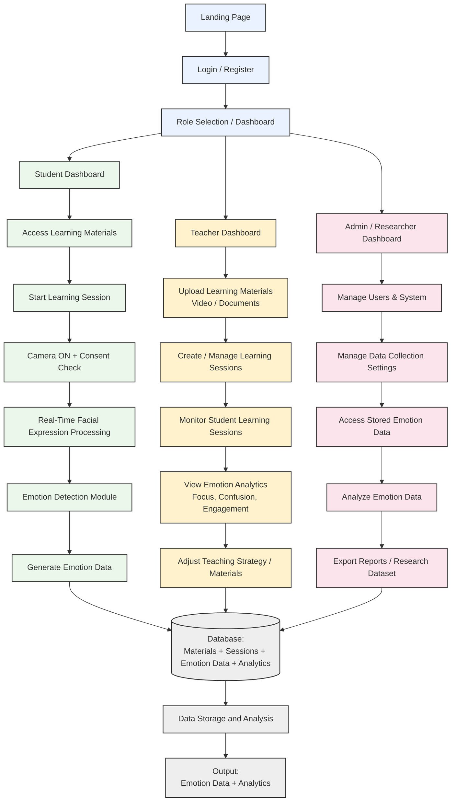

```mermaid
flowchart TD
    A[Landing Page] --> B[Login / Register]
    B --> C[Role Selection / Dashboard]

    C --> S[Student Dashboard]
    C --> T[Teacher Dashboard]
    C --> R[Admin / Researcher Dashboard]

    %% Student Flow
    S --> S1[Access Learning Materials]
    S1 --> S2[Start Learning Session]
    S2 --> S3[Camera ON + Consent Check]
    S3 --> S4[Real-Time Facial Expression Processing]
    S4 --> S5[Emotion Detection Module]
    S5 --> S6[Generate Emotion Data]

    %% Teacher Flow
    T --> T1[Upload Learning Materials<br/>Video / Documents]
    T1 --> T2[Create / Manage Learning Sessions]
    T2 --> T3[Monitor Student Learning Sessions]
    T3 --> T4[View Emotion Analytics<br/>Focus, Confusion, Engagement]
    T4 --> T5[Adjust Teaching Strategy / Materials]

    %% Admin / Researcher Flow
    R --> R1[Manage Users & System]
    R1 --> R2[Manage Data Collection Settings]
    R2 --> R3[Access Stored Emotion Data]
    R3 --> R4[Analyze Emotion Data]
    R4 --> R5[Export Reports / Research Dataset]

    %% Shared System Modules
    S6 --> D[(Database:<br/>Materials + Sessions + Emotion Data + Analytics)]
    T5 --> D
    R5 --> D

    D --> A1[Data Storage and Analysis]
    A1 --> A2[Output:<br/>Emotion Data + Analytics]

    %% Styling
    classDef main fill:#eaf2ff,stroke:#333,stroke-width:1.5px;
    classDef student fill:#eaf7ea,stroke:#333,stroke-width:1.5px;
    classDef teacher fill:#fff2cc,stroke:#333,stroke-width:1.5px;
    classDef admin fill:#fce4ec,stroke:#333,stroke-width:1.5px;
    classDef database fill:#eeeeee,stroke:#333,stroke-width:1.5px;

    class A,B,C main;
    class S,S1,S2,S3,S4,S5,S6 student;
    class T,T1,T2,T3,T4,T5 teacher;
    class R,R1,R2,R3,R4,R5 admin;
    class D,A1,A2 database;
```