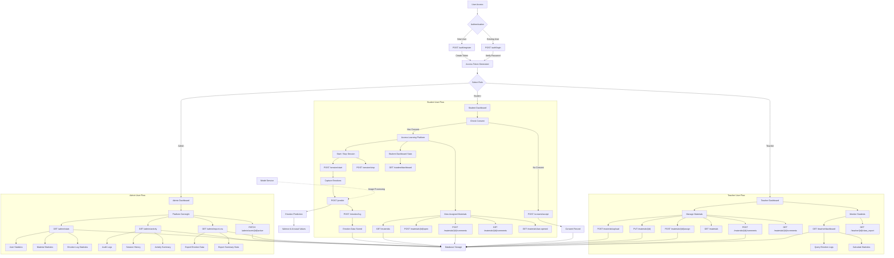
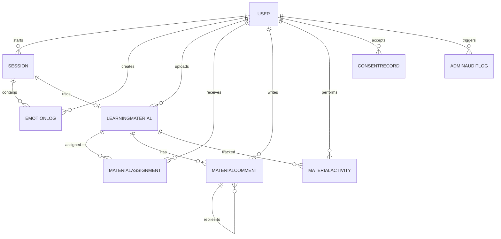
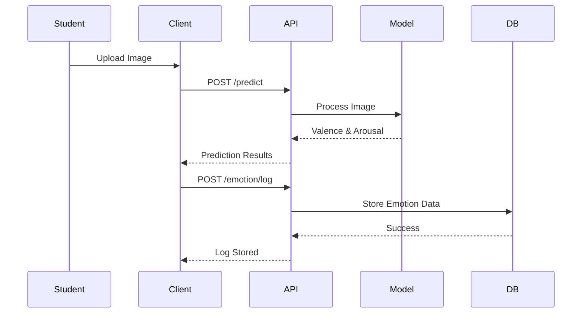
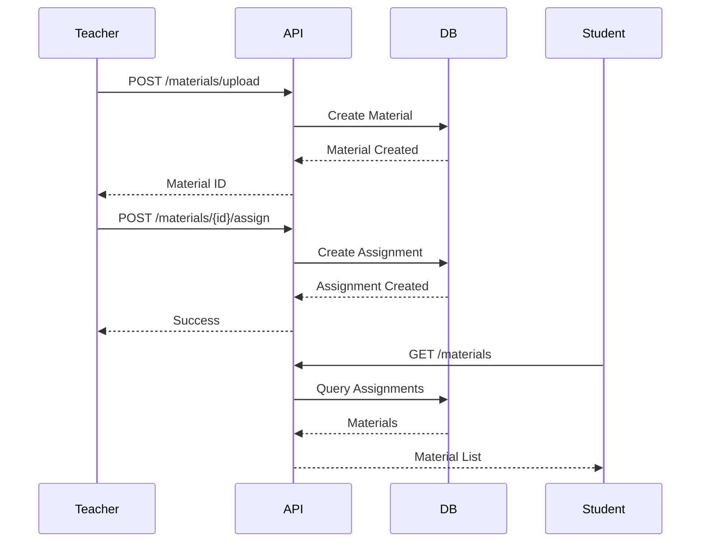

# API Flowchart - Arousal-Valence Learning Platform

## Application Architecture & Flow

## Endpoint Summary by Role

### Authentication
- `POST /auth/register` - User registration
- `POST /auth/login` - User login
- `GET /auth/me` - Get current user info
- `POST /auth/password-reset-request` - Password reset request

### Consent Management
- `GET /consent/me` - Get user consent status
- `POST /consent/accept` - Accept consent
- `POST /consent/withdraw` - Withdraw consent

### Student Endpoints
- `POST /predict` - Upload image for emotion prediction
- `POST /emotion/log` - Log emotion data
- `POST /session/start` - Start learning session
- `POST /session/stop` - Stop learning session
- `GET /materials` - List assigned materials
- `POST /materials/{id}/open` - Record material opened
- `GET /materials/last-opened` - Get last accessed material
- `POST /materials/{id}/comments` - Add comment to material
- `GET /materials/{id}/comments` - Get material comments
- `GET /student/dashboard` - View personal emotion dashboard

### Teacher Endpoints
- `POST /materials/upload` - Upload learning material
- `PUT /materials/{id}` - Update material
- `POST /materials/{id}/assign` - Assign material to student
- `GET /materials` - List own materials
- `POST /materials/{id}/comments` - Comment on material
- `GET /materials/{id}/comments` - View material comments
- `GET /teacher/dashboard` - View class emotion analytics
- `GET /teacher/{id}/class_report` - Compatibility endpoint

### Admin Endpoints
- `GET /admin/stats` - Platform statistics
- `GET /admin/activity` - Activity logs and audit trail
- `PATCH /admin/users/{id}/active` - Toggle user active status
- `GET /admin/export.csv` - Export all data to CSV

### Utility Endpoints
- `GET /health` - Health check
- `GET /` - Login page
- `GET /student` - Student dashboard page
- `GET /teacher` - Teacher dashboard page

## Data Models

## Key Flows

### Emotion Capture Flow

### Material Assignment Flow

